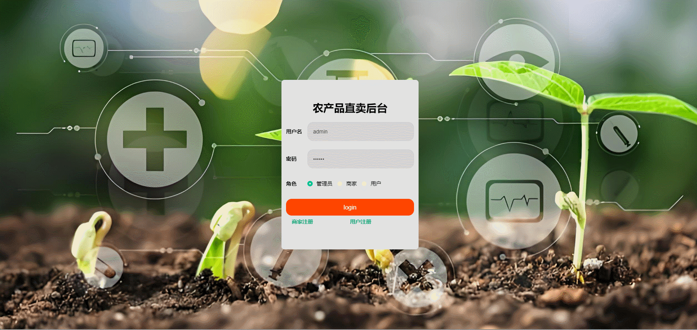

# sales-of-agricultural-products🎂

基于SpringBoot+Vue的农产品倾销平台

## 介绍🌞

> 随着中国式现代化的飞速发展，生产工具不断升级，商品数量迅速增长，基于此出现了许多网上销售渠道，但如何帮助农村农民售卖农产品值得成为我们关注的问题。因此，本文介绍一个基于web开发设计的农产品直卖平台，针对现有农产品销售渠道较为单一、线上销售空间狭小的问题进行优化，更好的帮助三农发展。

## 软件架构🌞

1. 后台可以提供给系统管理员、商家、普通用户使用，其中管理员具有基础数据管理功能、农产品管理功能、公告信息管理功能、商家管理功能、用户管理功能、轮播图管理功能、个人中心管理功能；商家具有农产品管理功能、公告信息管理功能、个人中心管理功能；普通用户具有农产品管理功能、个人中心管理功能、购物车功能、公告信息功能、商家信息功能
2. 前台模块具有首页展示功能、公告展示功能、农产品展示功能、商家展示功能、个人中心功能、购物车展示功能

## 项目演示🌞

>管理员




>商家


>普通用户


## 安装教程🌞

```
1. 运行环境准备mysql8 + java8 + node14.16.1

2. 配置maven路径，加载依赖

3. 运行sql文件，确保application.yml或config.properties的数据库名称和账号密码是数据库所在主机的账号密码
```


## 使用说明🌞

```
1. 登入

    管理员账号：admin 密码：123456

    商家账号：xianduoduo 密码：123456

    普通用户账号：zhangsan 密码：123456
  
2. 运行流程

SpringBoot+Vue项目的部署详情可以查看这篇CSDN博客：http://t.csdnimg.cn/kpuxS

前后端不分离项目的部署流程可以查看这篇CSDN博客：http://t.csdnimg.cn/CslA5
```


## CSDN项目合集🌞

点击前往：http://t.csdnimg.cn/Q4u84


## 联系我🌞

**有偿获取完整源码或调试代码**

🐧：1902317191

wx：coding1902317191


